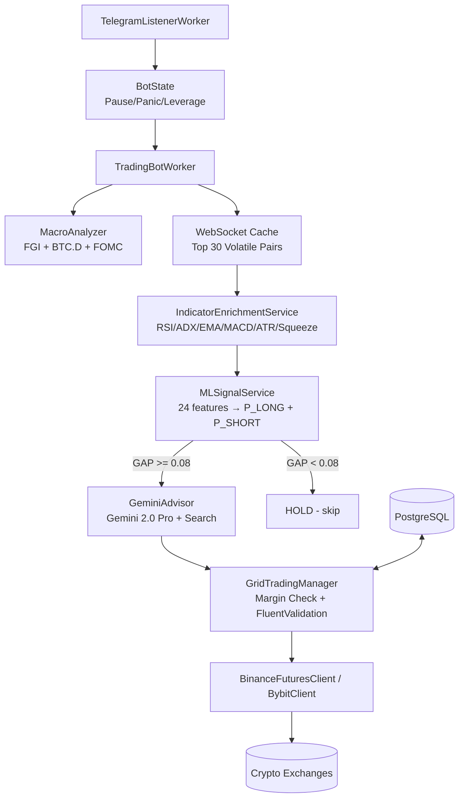

# NetTrader: Architecture

## Triple-Loop System

NetTrader uses three concurrent loops with different frequencies:

```
TradingBotWorker (main loop, 1s tick)
│
├─ EVERY 1s: Process Telegram Commands + /panic instant check
│     └─ /panic, /pause, /resume, /leverage, /cycle, /close, /positions, /pnl, /market, /settings
│
├─ EVERY 10s: Fast Monitor (MonitorAndProtectAsync)
│     ├─ Check ROI of all active positions
│     ├─ ROI > 3% → activate Trailing Stop (callback 0.3% at x10)
│     └─ Ensure SL/TP orders exist on exchange
│
├─ EVERY 15s: ML Quick Scan (NEW in v2.1)
│     ├─ Fetch top 30 volatile pairs from WebSocket cache
│     ├─ Compute 24 ML features (indicators + BTC context)
│     ├─ Run ModelLong + ModelShort predictions
│     ├─ If GAP >= 0.08 AND P >= 0.44 → trigger AI cycle!
│     └─ Cooldown: minimum 5 min between AI cycles
│
└─ EVERY 30m: Scheduled AI Cycle (or triggered by ML/manual)
      ├─ MacroAnalyzer → FGI, BTC.D, FOMC distance
      ├─ IndicatorEnrichmentService → RSI/ADX/EMA/MACD/ATR/Squeeze
      ├─ MLSignalService → 24 features → P(LONG) + P(SHORT)
      ├─ GeminiAdvisor → AI strategy (Gemini 2.0 Pro + Google Search)
      │     ├─ AI sets: direction, SL, TP, investment size, grid levels
      │     ├─ ML signal is INFORMATION, not a blocker — AI decides freely
      │     ├─ System only enforces sanity guards (min/max bounds)
      │     └─ Fallback: Pro → Pro(no search) → Flash
      └─ GridTradingManager → margin check, position management
            ├─ Direction flip: LONG→SHORT or SHORT→LONG auto-closes old position
            ├─ Duplicate check: if position exists + same direction → only update SL/TP
            ├─ Stale session cleanup: posAmt=0 on exchange → close session in DB
            ├─ Margin auto-reduce: shrinks investment to fit available
            ├─ Execution order: MKT orders first, GRID orders last
            └─ Execute on Binance Futures / Bybit V5
```

---

## Layer Breakdown (Clean Architecture)

### Domain (`NetTrader.Domain`)
Zero external dependencies.
- **Entities**: `MarketData`, `TradeSession`, `GridOrder`, `GridSettings`
- **Interfaces**: `IMarketDataProvider`, `IAiAdvisor`, `IMLSignalService`, `IOrderExecutor`, `ITradeRepository`
- **Options**: `TradingOptions`, `BinanceOptions`, `BybitOptions`
- **Constants**: `TradeStatus`, `BotCommandType`

### Application (`NetTrader.Application`)
- **`GridTradingManager`** — position lifecycle: open, trailing stop, close, margin check
- **`IndicatorEnrichmentService`** — RSI, ADX, EMA, MACD, ATR, Bollinger, Squeeze

### Infrastructure (`NetTrader.Infrastructure`)
- **`BinanceFuturesClient`** — Binance Futures REST + WebSocket (auto-timestamp sync)
- **`BybitClient`** — Bybit V5 Perpetual
- **`GeminiAdvisor`** — v9 prompt, AI-driven sizing/SL/TP, ML as info (not blocker), JSON parsing, fallback
- **`MLSignalService`** — 24-feature computation, dual FastTree+Platt models
- **`MacroAnalyzer`** — Fear & Greed (alternative.me), BTC.D (CoinGecko/blockchain.info), FOMC
- **`TelegramService`** — notifications, daily reports

### Worker (`NetTrader.Worker`)
- **`TradingBotWorker`** — triple-loop: commands(1s) + monitor(10s) + ML scan(15s) + AI(30m)
- **`TelegramListenerWorker`** — listens for commands, writes to BotState

---

## Data Flow Diagram



---

## AI Advisor (GeminiAdvisor v9)

### Key Principles
- **AI drives decisions**: AI sets investment size, SL, TP, grid levels
- **System only guards**: sanity checks (SL wrong side? TP too far? Investment > 25% buying power per position?)
- **SL/TP from entry**: system auto-recalculates SL/TP from actual fill price (-2%/+5%)
- **Leverage-aware prompt**: AI knows actual leverage, buying power, ATR values

### Fallback Chain (3 attempts, 3-min timeout each)
1. `gemini-3.1-pro-preview` + Google Search (real-time news)
2. `gemini-3.1-pro-preview` without Search
3. `gemini-3.1-flash-preview` (fast, last resort)

### Prompt includes
- Balance, leverage, buying power
- Macro: FGI, BTC.D, FOMC distance
- Per-coin: RSI, ADX, Trend, MACD, ATR, Squeeze, EMA distances
- ML signal: `ML:LONG P(L)=0.48 P(S)=0.39 GAP=0.09` or `ML:HOLD`
- ML is **information** for AI, not a blocker — AI can trade against ML signal if it has reason

---

## Margin Check Logic

```
Available = max(0, GetAvailableBalanceAsync())  // protect negative
MarginNeeded = TotalInvestment / Leverage
If MarginNeeded > Available:
    MaxNominal = Available * Leverage
    If MaxNominal >= 5$:
        Reduce investment to MaxNominal  // auto-shrink
    Else:
        Skip symbol  // truly not enough
Deduct: Available -= MarginNeeded
```

---

## Risk Management

| Level | Trigger | Action |
|-------|---------|--------|
| ML Signal | GAP < 0.08 or P < 0.44 | HOLD signal (info for AI, not blocking) |
| Margin Guard | Available < 0 or insufficient | Auto-reduce investment or skip |
| Stop Loss | AI-set (typically -2%) | Close position via exchange order |
| Take Profit | AI-set (typically +5%) | Close position via exchange order |
| Trailing Stop | ROI > 3% | Cancel grid, place TRAILING_STOP_MARKET (callback 0.3%) |
| Duplicate Guard | Position already exists | Only update SL/TP, don't open new |
| Daily Drawdown | Day loss > 10% | Pause 12 hours |
| Balance Guard | Balance < 50% initial | Emergency stop, close everything |
| `/panic` | Telegram command | Immediate close all positions |

---

## Configuration Reference

```json
{
  "Trading": {
    "CheckIntervalMinutes": 30,        // Scheduled AI cycle interval
    "MlQuickScanIntervalSeconds": 15,  // ML fast scan interval
    "MinAiCooldownSeconds": 300,       // Min gap between AI cycles (5 min)
    "FastMonitoringIntervalSeconds": 10,// ROI/trailing check interval
    "TopVolatilityCount": 30,          // Coins to scan
    "DefaultLeverage": 10,             // Default leverage (changeable via /leverage)
    "TrailingActivationRoiPercent": 3.0,// ROI% to activate trailing
    "TrailingCallbackRatePercent": 3.0, // Trailing callback (÷ leverage = 0.3%)
    "MaxMarginUsagePercent": 0.8,      // Max 80% of balance for positions
    "EmergencyStopBalancePercent": 0.5, // Stop if balance < 50% start
    "DailyDrawdownPausePercent": 10,   // Pause if day loss > 10%
    "DrawdownPauseHours": 12,          // Pause duration
    "MlModelPath": "mlmodel"           // Path to ModelLong.zip + ModelShort.zip
  }
}
```

---

## Telegram Commands

| Command | Action |
|---------|--------|
| `/panic` | Close all positions immediately (checked every 1s in main loop) |
| `/pause` | Pause trading |
| `/resume` | Resume trading |
| `/leverage N` | Set leverage (e.g., `/leverage 10`) |
| `/cycle` | Force immediate AI cycle |
| `/status` | Show bot state, balance, active sessions |
| `/close SYMBOL` | Close specific position (e.g., `/close BTCUSDT`) |
| `/positions` | Show all open positions with live PnL, ROI%, direction, SL/TP |
| `/pnl` | Balance, unrealized PnL, last 5 closed trades |
| `/market SYMBOL` | Price, RSI, ADX, trends, ML signal + probabilities |
| `/settings` | Current bot configuration overview |
| `/help` | Show all commands with descriptions |

---

## Direction Flip (v9)

When AI changes direction for an existing position (LONG→SHORT or SHORT→LONG):
1. Detect conflict: `posAmt > 0` (LONG) vs `OrderType=2` (SHORT) or vice versa
2. Cancel all SL/TP and limit orders for the symbol
3. Close the existing position via `ClosePositionAsync`
4. Update session status to `Closed` with `ClosedAt`
5. Open new position in the requested direction
6. Set new SL/TP for the new direction
